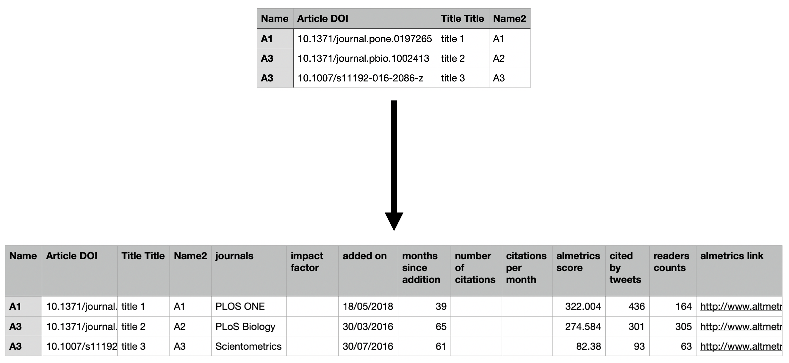

# Altmetrics_parser
Uses PyAlmetric to get almetric info over command line or processes csv file with multiple article DOIs

### Commmand line:
*Get almetrics info in command line based on DOI*
```
python get_almetrics.py -d "10.1371/journal.pone.0197265"

Title: Academic information on Twitter: A user survey
Authors: Ehsan Mohammadi, Mike Thelwall, Mary Kwasny, Kristi L. Holmes
added_on: 18/05/2018
Months since addition: 39
Cited by tweets: 436
Almetrics readers: 164
```

### Using CSV
*Provide .csv (-c) file with a column containing DOIs (-l)*

*Takes .csv (sample_form.csv) file from microsoft forms for instance and generates a processed file (sample_form_processed.csv)*

`python get_almetrics.py -c sample_form.csv -l "Article DOI"`



### Installation instructions
1. Install [pyAltmetric](https://github.com/wearp/pyAltmetric)
2. Install pandas 
3. Download get_almetrics.py and use (-h) for help
